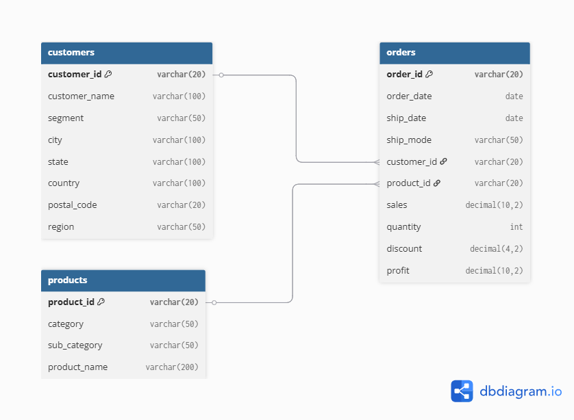

# Superstore Sales Analysis - SQL Project



## 📋 Project Overview
A comprehensive analysis of Superstore sales data using MySQL, demonstrating SQL skills for data exploration, transformation, and visualization.

**Dataset**: [Sample Superstore Data](https://www.kaggle.com/datasets/vivek468/superstore-dataset-final) (2015-2018)

## 🛠️ Technical Skills Demonstrated
- Database design (ER modeling)
- Complex SQL queries (JOINs, CTEs, window functions)
- Data aggregation and transformation
- Performance optimization

## 📊 Database Schema
The database consists of 3 main tables with the following relationships:
- **Customers** can place multiple **Orders**
- **Products** can appear in multiple **Orders**


## 🔍 Key Findings
1. **Office Supplies** generate the highest profit margins (16.83%)
2. **February sales** is the highest sales (40,602.27)
3. Corporate segment has the highest average order value
4. New York City shows strongest sales value

## 🚀 How to Run This Project

### Prerequisites
- MySQL 8.0+
- MySQL Workbench (optional)

### Setup Instructions
1. Clone repository:
   ```bash
   git clone https://github.com/annkaveesha69/superstore-analysis.git
   cd superstore-analysis
